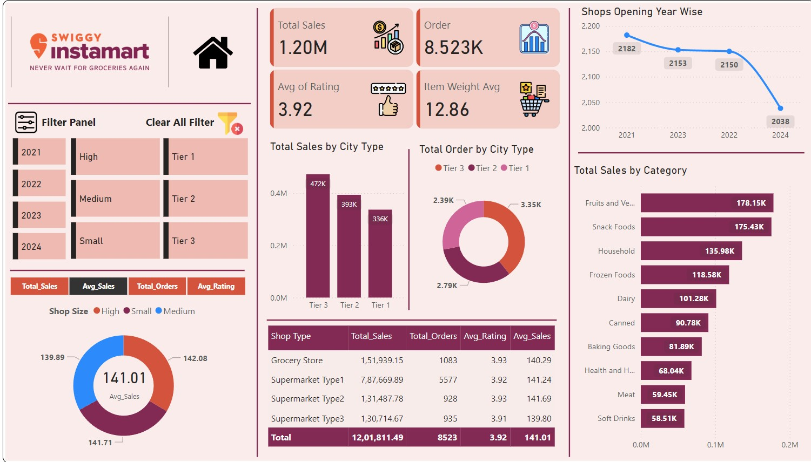

## 📷 Dashboard Preview

  

---

## 📊 Dashboard Highlights

### Executive KPIs

* 💰 Total Sales: **1.20M**
* 📦 Total Orders: **8,523**
* ⭐ Average Rating: **3.92**
* 📈 Average Sales: **141.01**

### Sales Insights

* Tier 3 cities generated the highest sales revenue.
* Fruits & Vegetables category achieved the highest sales contribution.
* Supermarket Type 1 delivered the maximum orders and revenue.

### Business Analysis

* City Tier Performance Analysis
* Shop Size Comparison
* Category-wise Sales Breakdown
* Shop Opening Trend Analysis
* Customer Rating Analysis

### Interactive Features

* Year-wise Filtering
* Shop Size Filtering
* City Tier Filtering
* Dynamic KPI Cards
* Drill-down Visualizations

---

### Dashboard Screenshot

